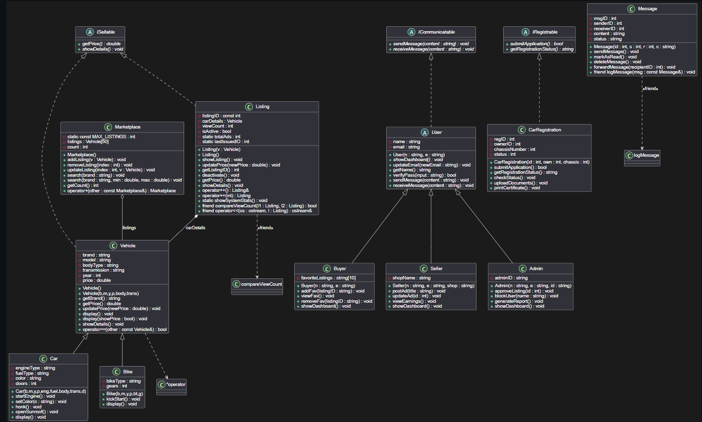

# OOP-Assignment-2

Assignment to demonstrate the knowledge of Object Oriented Programming. Language used: C++

**Student ID:** 25k-0127  
**Course:** Object-Oriented Programming  
**Instructor:** Talha Shahid  

---

## 2. System Overview (Classes)

| Class | Role |
|-------|------|
| `User` | Abstract base for all users |
| `Buyer` | Can save favourites, send messages |
| `Seller` | Can post/update ads, view earnings |
| `Admin` | Can approve/block listings and users |
| `Vehicle` | Base for all vehicles |
| `Car` | Specific car details (engine, doors) |
| `Bike` | Specific bike details (type, gears) |
| `Listing` | An advertisement (composes a Vehicle) |
| `Marketplace` | Aggregates many Vehicles (search/add/remove) |
| `Message` | Standalone – buyer‑seller communication |

---

## 3. OOP Principles Used (Assignment 1 recap)

- **Encapsulation:** Private data members accessed via public getters/setters.  
- **Composition:** `Listing` owns a `Vehicle` – if listing is destroyed, the vehicle data is gone.  
- **Aggregation:** `Marketplace` holds an array of `Vehicle` – vehicles can exist without a marketplace.  
- **Static members:** `totalAds` and `lastIssuedID` in `Listing` – shared across all listings.  
- **Constant member:** `listingID` is `const` – never changes after creation.

---

## 4. New Advanced Concepts for Assignment 2

### 4.1 Inheritance – relationships

| Relationship | Justification |
|--------------|----------------|
| `User` → `Buyer` | Buyer **is a** User (has name, email, dashboard) |
| `User` → `Seller` | Seller **is a** User with shop‑specific features |
| `User` → `Admin` | Admin **is a** User with system‑management powers |
| `Vehicle` → `Car` | Car **is a** Vehicle with engine, doors, etc. |
| `Vehicle` → `Bike` | Bike **is a** Vehicle with bike‑type, gears |
| `ISellable` → `Vehicle`, `Listing` | Anything that can be sold must implement `getPrice()` and `showDetails()`. |

### 4.2 Polymorphism

#### Function Overloading

```cpp
// In Marketplace
void search(string brand);                     // search only by brand
void search(string brand, double min, double max); // by brand + price
Justification: Allows caller to choose level of detail – simple brand search or filtered by price.

### 4.2 Polymorphism (continued)

#### Function Overriding (virtual)

```cpp
class Vehicle {
    virtual void display() const { cout << brand << " " << model << " - $" << price; }
};
class Car : public Vehicle {
    void display() const override { 
        Vehicle::display(); 
        cout << " | Engine: " << engineType << endl; 
    }
};
class Bike : public Vehicle {
    void display() const override { 
        Vehicle::display(); 
        cout << " | Bike Type: " << bikeType << endl; 
    }
};
Justification: Each vehicle type shows its own extra details while reusing the base format – runtime polymorphism.

#### 4.3 Abstraction
Separate header files:

ISellable.h

ICommunicatable.h

IRegistrable.h

Each header contains only the interface (pure virtual functions). Implementation is in main.cpp.

Justification: Hides implementation details, forces derived classes to provide concrete behaviour, extensible.

### 4.4 Operator Overloading

| Operator | Class | Purpose | Code |
|----------|-------|---------|------|
| `==` | `Vehicle` | Compare brand, model, year | `bool operator==(const Vehicle& other) const { return (brand==other.brand && model==other.model && year==other.year); }` |
| `++` (pre/post) | `Listing` | Increment view count | `Listing& operator++() { viewCount++; return *this; }` <br> `Listing operator++(int) { Listing temp = *this; viewCount++; return temp; }` |
| `+` | `Marketplace` | Merge two marketplaces | `Marketplace operator+(const Marketplace& other) const { ... }` |
| `<<` | `Vehicle` (friend) | Print vehicle | `friend ostream& operator<<(ostream&, const Vehicle&);` |

**Justification:** Improves readability – `car1 == car2`, `mp1 + mp2`, `++listing`, `cout << vehicle`.

### 4.5 Friend Functions 

| Friend Function | Accesses | Why friend? |
|----------------|----------|--------------|
| `operator<<` for `Vehicle` | `brand`, `model`, `price` | Print private data without getters. |
| `compareViewCount` | `Listing::viewCount` | Compare listings by views – needs direct access. |
| `logMessage` | `Message::msgID`, `content`, `status` | Logging utility – not a member but needs internal data. |

**Justification:** Friend functions allow non‑member functions to access private members when a member function would be unnatural (e.g., `cout << vehicle`).

**Terminal Output:**
*===== ASSIGNMENT 2  =====*

ISellable pointer -> Toyota Camry - $35000 | Engine: 2.5L


Search by brand only: 
Honda Civics - $27000Honda Accord - $75000
Search by brand + price: 
Honda Civics - $27000
Polymorphic display: Suzuki Swift - $19000 | Engine: 1.3L


Operator== works: c1 and c2 are same vehicle(Yuppie!)
After ++listing twice: Listing #1 (Views: 2)
Combined marketplace has 3 listings (operator+)

Friend operator<< for Vehicle: Tesla Camryy ($37000)
Logging: ID=101 Content=Hello, Tooba is interested in the car Status=Unread
l1 has more views than l2 
Favorites: 6001 
Listing 123 approved
Updated listing at index 5:
After removal, marketplace has 1 listings.

--- Buyer sending msg to Seller ---
[User] Sending: hii, is the car still available?
[User] Received: Hello, yes maybe!

## 6. Updated UML Class Diagram



The diagram includes:
- All 10 classes from Assignment 1
- Abstract classes (`ISellable`, `ICommunicatable`, `IRegistrable`) shown in italics
- Inheritance (solid line, hollow triangle)
- Composition (filled diamond) – `Listing` → `Vehicle`
- Aggregation (empty diamond) – `Marketplace` → `Vehicle`
- Friend relationships (dashed line with `<<friend>>`)
- Operator overloads noted in the method section
